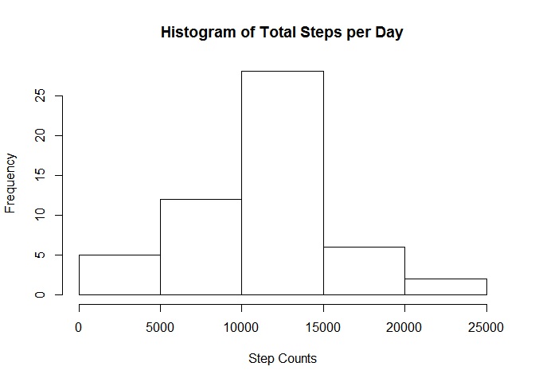
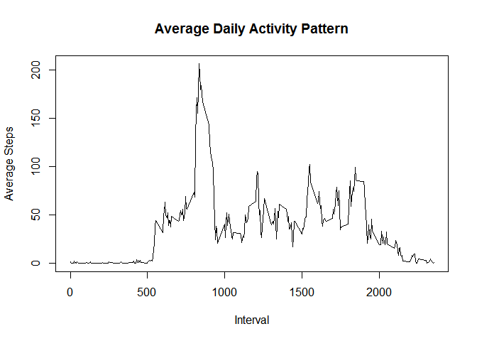
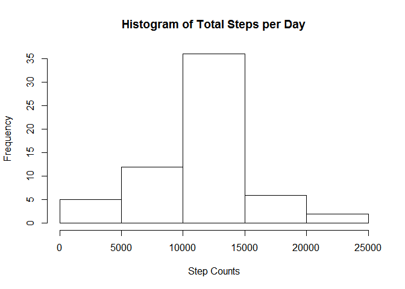
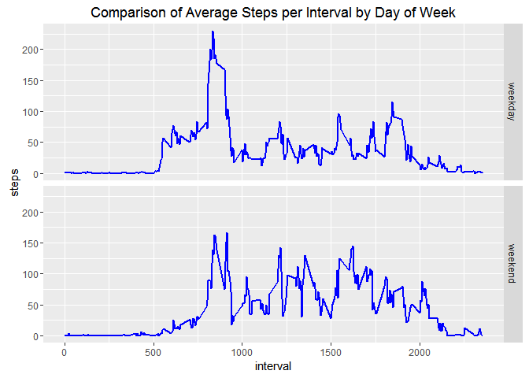

# Reproducible Research: Peer Assessment 1
Doing some environment setup and loading relevant packages

```r
# Clean up the plot environment, irrelevant to script
dev.off()
```

```
## null device 
##           1
```

```r
library(dplyr)  
```

```
## Warning: package 'dplyr' was built under R version 3.2.4
```

```
## 
## Attaching package: 'dplyr'
```

```
## The following objects are masked from 'package:stats':
## 
##     filter, lag
```

```
## The following objects are masked from 'package:base':
## 
##     intersect, setdiff, setequal, union
```

```r
library(ggplot2)
```

```
## Warning: package 'ggplot2' was built under R version 3.2.4
```


## Loading and preprocessing the data
For the purposes of this assignment I've already unzipped the activity.zip file in the same directory.  Remove any lines that have NA for steps.


```r
activitydata <- read.csv("./activity/activity.csv")  
activitydataclean <- activitydata[!is.na(activitydata$steps),]
```


## What is mean total number of steps taken per day?
Aggregate the data in groups by the date, ignoring blank lines.  Then make a histogram of the total number of steps taken each day.  Also calculate and report the mean and median of the total number of steps per day.


```r
activitydataday <- activitydataclean %>% group_by(date) %>% summarise(steps = sum(steps))  
hist(activitydataday$steps,main="Histogram of Total Steps per Day",xlab="Step Counts")
```



We can use summarize to determine the mean and median step values.


```r
summarize(activitydataday, mean = mean(steps), median = median(steps))
```

```
## Source: local data frame [1 x 2]
## 
##       mean median
##      (dbl)  (int)
## 1 10766.19  10765
```

## What is the average daily activity pattern?
Make a time-series plot of the 5-minute interval and the average number of steps taken, average across all days.  
We assume to ignore NA lines here as well.


```r
activitydatainterval <- activitydataclean %>% group_by(interval) %>% summarise(steps = mean(steps))
plot(activitydatainterval$interval, activitydatainterval$steps, type="l", xlab="Interval", ylab="Average Steps", main="Average Daily Activity Pattern")
```



We use the max function to find which row had the maximum average number of steps.


```r
activitydatainterval[which.max(activitydatainterval$steps),]
```

```
## Source: local data frame [1 x 2]
## 
##   interval    steps
##      (int)    (dbl)
## 1      835 206.1698
```

## Inputing missing values
Calculate and report the total number of missing values in the dataset.  Shove in a frame call 'nulldata', and report the size.


```r
nulldata <- activitydata[is.na(activitydata$steps),]
nrow(nulldata)
```

```
## [1] 2304
```

Devise a strategy to fill in the missing data.  Here we will fill in missing data with the average value for the same interval, by merging the data set we found in the previous step.  Note we take a subset since we don't need nulldata's $steps column since they were all NA.  This new set will be put in a data frame "fillnulldata".


```r
fillnulldata <- merge(activitydatainterval, subset(nulldata,select=c(date,interval)), by="interval")
```

Create a new dataset that is equal to the original dataset but with the missing data filled in.  We will merge "fillnulldata" with "activitydataclean" to create "activitydatafill".


```r
activitydatafill = rbind(activitydataclean,fillnulldata)
```

Make a histogram of the total number of steps taken each data and calculate and report the mean and median total number of steps.  To do so we repeat the same process as in the first part of this assignment.


```r
activitydatadayfill <- activitydatafill %>% group_by(date) %>% summarise(steps = sum(steps))
hist(activitydatadayfill$steps,main="Histogram of Total Steps per Day",xlab="Step Counts")
```



```r
summarize(activitydatadayfill, mean = mean(steps,na.rm=TRUE), median = median(steps,na.rm=TRUE))
```

```
## Source: local data frame [1 x 2]
## 
##       mean   median
##      (dbl)    (dbl)
## 1 10766.19 10766.19
```

Note here that the mean is the same but the median has also shifted to the mean value.  Based on the estimate we used, the histogram distribution resulted in more counts towards the average value bin.  This makes sense; the data was always missing for the entire day, not just occasional intervals.  So the method we used to fill in the missing data, would always result in the mean staying the same and the median shifting toward the mean since we were grouping by day.

## Are there differences in activity patterns between weekdays and weekends?
Create a new factor variable in the dataset with two levels: "weekday" and "weekend".  Here we put them in a frame activitydatafill2.  We find the average for each of the five minute intervals the same as we did earlier.


```r
activitydatafill2 <- mutate(activitydatafill,dayofweek=ifelse(weekdays(as.Date(activitydatafill$date)) == "Saturday" | weekdays(as.Date(activitydatafill$date)) == "Sunday", "weekend", "weekday"))
```

Make a panel plot containing a time series plot of the 5 minute interval and the average number of steps taken, average across all weekday days or weekend days.


```r
activitydataintervalfill <- activitydatafill2 %>% group_by(interval,dayofweek) %>% summarise(steps = mean(steps))
qplot(interval, steps, data=activitydataintervalfill, facets=dayofweek~., geom=c("line")) + geom_line(size=1, color="blue") + labs(title = "Comparison of Average Steps per Interval by Day of Week")
```


